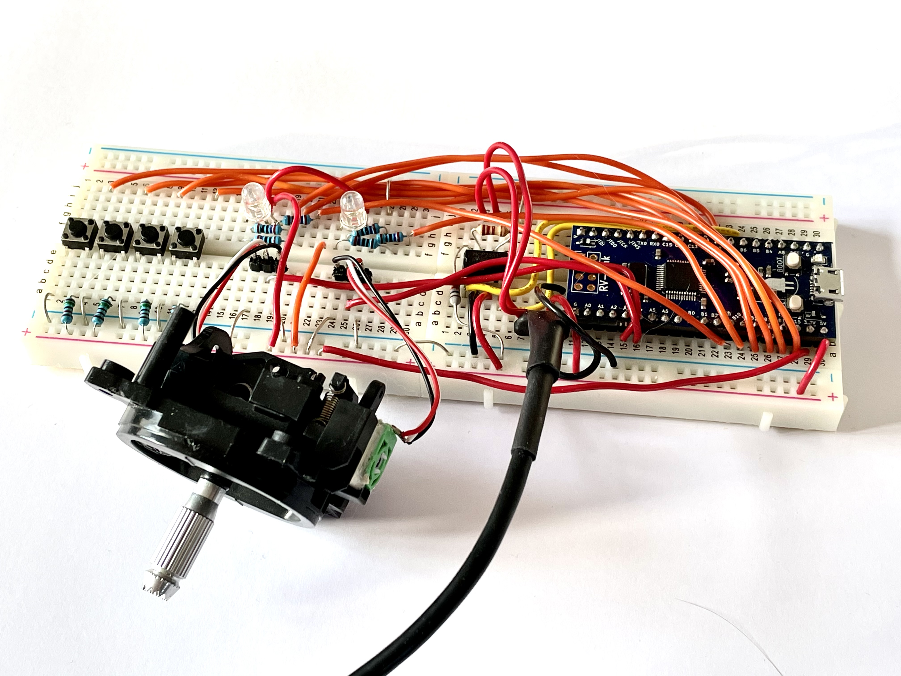

 

## I2C Basic Example

 

Check the app.c file for specifics on how to use the CAN bus on GD32VF103, this example requires some extra harware to work, most notably a CAN-bus tranceiver such as SN65HVD230 or MCP2551. The example also assumes that something is connected to A3 and a4 such as a potentiometer with an analog signal. A5-A8 are handled as buttons or switches. B8-B11 are outputs.

 

Image of how the author implemented the circuit:
